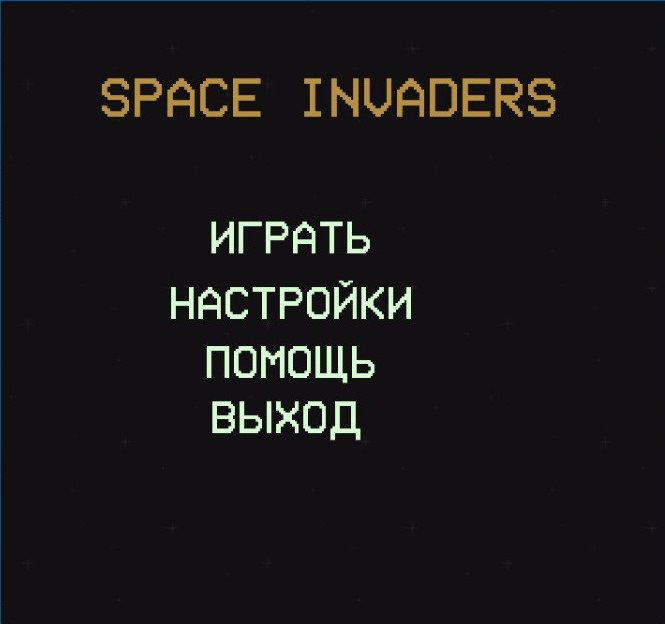
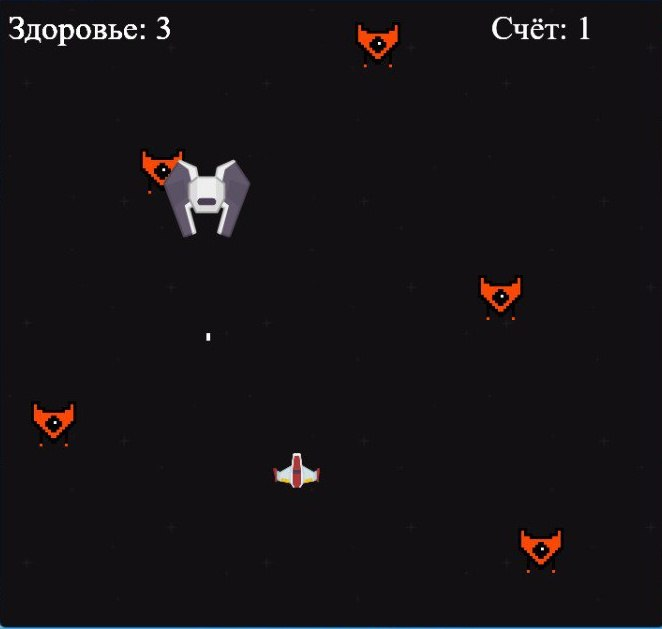

# Space Invaders
Space Invaders - это классическая аркадная игра, вышедшая в 1978 году, в которой мы играем за некий корабль, расстреливающий вражеские корабли. Корабли идут волнами,
примерно, из 10 штук. Здесь же мы будем создавать свою версию игры на pygame.

## ТЗ. Функции игры:
* Управление кораблём нажатием клавиш.
* Взаимодействие между спрайтами.
* Различные бонусы.
* Результат игры. 
* Музыкальное сопровождение.

### Пояснительная записка
#### Название проекта
* __Space Invaders__
#### Автор проекта
* Полин Илья
#### Презентация
* [Здесь](https://docs.google.com/presentation/d/1FXuptfe8S_ETLoeamYRFrD6dIDfen5Sw/edit#slide=id.p1)

#### Описание идеи:
Моя игра представляет собой шутер с видом сверху. Цель игрока - убить как можно больше кораблей

#### Принцип работы:

Чтобы реализовать игру на Python я подключил библиотеку pygame, так как библиотека pygame предоставляет огромные возможности для разработки игр на Python. При помощи Python я создал классы, необходимые для работы игры. Среди них: класс игрока (__Player__), враги(__Enemy__) и прочее. Основной функцией для всех классов является функция update(), которая отвечает за отрисовку спрайтов на экране.

Помимо классов я создал функции, отвечающие за следующие действия:
* Вывод меню
* Вывод инструкции
* Вывод настроек
* Запуск игрового цикла
* Вывод финального окна и счёт игрока

Для запуска игры необходима библиотека pygame!
### Скриншоты
#### Главное меню

#### Игра

